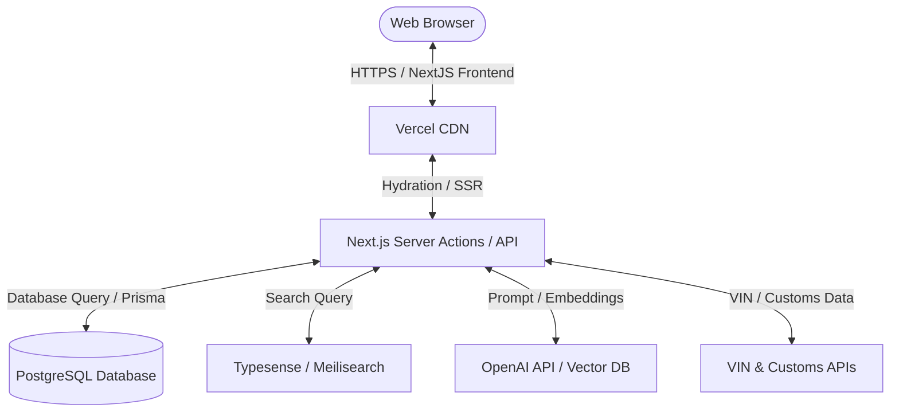

# Complete Rebuild Blueprint (Sarkin Mota 2.0)

This blueprint outlines the recommended system architecture, technical stack, information architecture, and deployment pipeline to rebuild and modernize the Sarkin Mota Autos platform.

---

## 1. Target Technology Stack

### 1. Frontend Framework
*   **Recommendation**: **Next.js 15 (App Router)**.
*   **Rationale**: Combines server-side rendering (SSR) for SEO-optimized vehicle pages, static site generation (SSG) for articles, and client-side hydration for calculators and dashboards.

### 2. Styling System
*   **Recommendation**: **Vanilla CSS / CSS Modules**.
*   **Rationale**: Keeps CSS light, structured, and fast while allowing customized radial gradients, typography configurations, and transitions for luxury branding.

### 3. Backend & ORM
*   **Recommendation**: **Node.js (Next.js Server Actions)** with **Prisma ORM**.
*   **Rationale**: Simplifies data management, automates database migrations, and matches the Next.js runtime environment.

### 4. Database
*   **Recommendation**: **PostgreSQL** (hosted via Neon or AWS RDS).
*   **Rationale**: Robust, relational data storage, natively supporting complex JSONB fields (for swap specifications and financial metrics) and geospatial queries.

### 5. Search Engine
*   **Recommendation**: **Typesense** or **Meilisearch**.
*   **Rationale**: Fast search, filtering, and facets on the vehicle catalog page (`/vehicles`).

### 6. Hosting & Cloud
*   **Recommendation**: **Vercel** (for Next.js frontend/serverless API) and **Supabase** (for DB and auth integration).
*   **Rationale**: Instant deployment, automated SSL, global edge caching, and serverless scaling.

---

## 2. Information Architecture (IA) Map

*   **Public Portal**
    *   `/` (Homepage with Flagship Carousels)
    *   `/vehicles` (Catalog Grid with Filters Sidebar)
    *   `/vehicles/[slug]` (Detail page, Specification Matrix, Inquiry form)
    *   `/news` (Editor post list)
    *   `/news/[slug]` (Editorial reader page)
*   **Ownership Tools**
    *   `/tools/ai-match` (Conversational search)
    *   `/tools/calculator` (Amortization calculator)
    *   `/tools/compare` (Specs comparison table)
    *   `/tools/estimator` (Customs duty calculator)
    *   `/tools/history` (VIN lookup page)
    *   `/tools/valuation` (Market estimator)
*   **Directories**
    *   `/network` (Network Portal)
    *   `/network/[category]` (Verified lists: brokers, customs clearing, experts, mechanics)
*   **Seller Portals**
    *   `/sell-swap` (Request Stepper Form)
    *   `/sell/dashboard` (Dealer listing controls)
*   **Corporate & Info**
    *   `/about` (Founder profile and brand history)
    *   `/contact` (Address, Google Map, email form)
    *   `/careers` (Job listings)

---

## 3. SEO & Analytics Infrastructure

1.  **Dynamic Sitemap Generation**: Next.js custom `sitemap.js` configuration automatically queries database slugs (vehicles and news articles) and outputs an XML feed at `/sitemap.xml`.
2.  **Metadata Templates**: Automated metadata generation in layout templates using the Next.js Metadata API, outputting standardized Title, Description, and Open Graph tags for WhatsApp sharing.
3.  **Analytics Integration**: Unified data layer logging user interaction events (calculator uses, AI matches, contact form submissions) to Google Analytics 4.

---

## 4. Scalability & Performance

*   **Image Optimization**: Next.js `<Image />` component automatically resizes and converts images to WebP/AVIF formats on the fly.
*   **Database Caching**: Redis integration to cache frequent database reads (such as active vehicle catalogues and news reviews).
*   **CDN Edge Caching**: Deploying SSR pages with Incremental Static Regeneration (ISR) to cache static pages on Vercel's edge network while updating them in the background as listings change.
